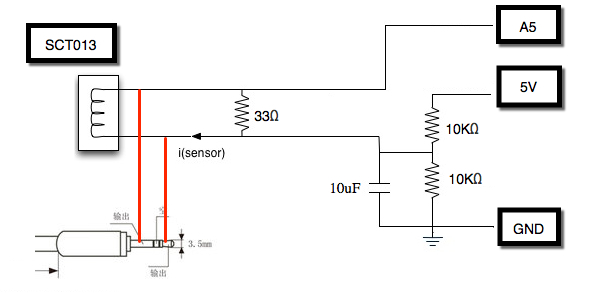
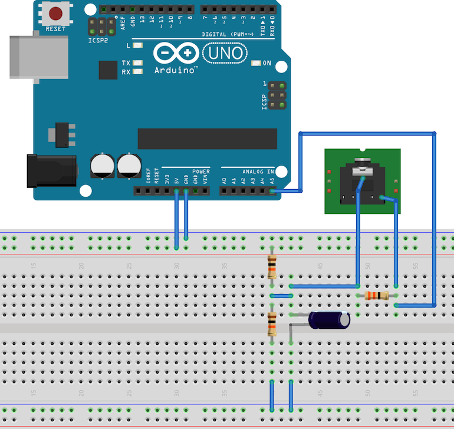

# Read CT Sensor Data

## Arduino

Each project needs a separate folder with the same name as the program file.

eg. sct013/sct013.ino


### Installation
```sh
make dev
make add-package
```

### Compile and Upload
```sh
make update
```

## Circuit Design

SCT013-100A 量測線路電流後，縮小為 0~50 mA 的電流數值輸出。
由於 Arduino 的 Analog 是讀取電壓值，因此需要將電流數值轉換為電壓。
透過下圖的電路設計可以幫助我們透過 Arduino 讀取 CT Sensor 的數值。



## Ref
+ [Arduino CLI](https://github.com/arduino/arduino-cli)
+ [Circuit design](https://cms.35g.tw/coding/arduino-using-sct013-measure-current/)
